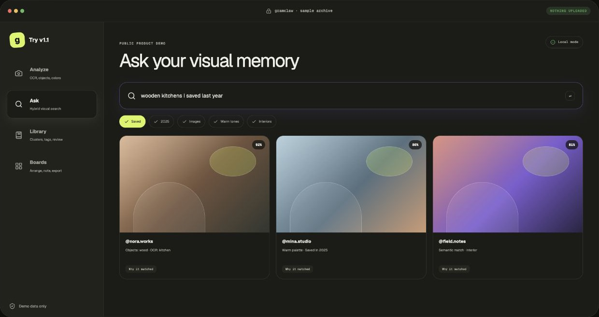
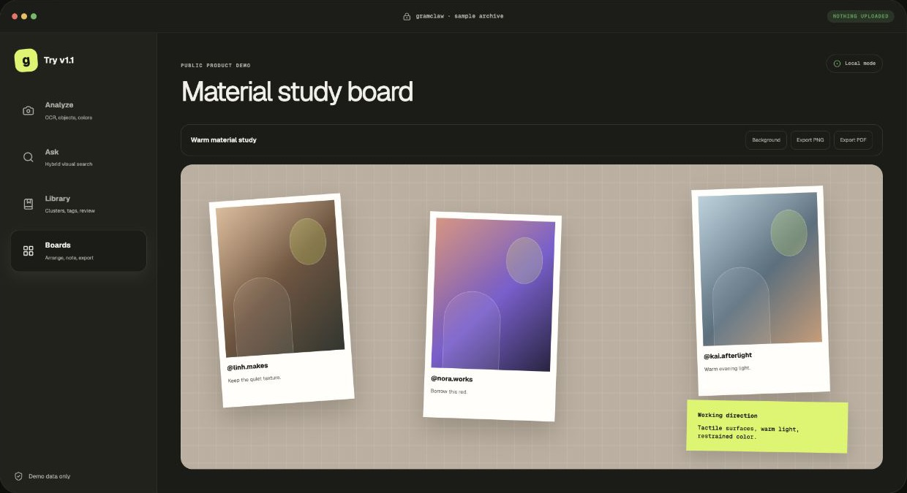

# Gramclaw

**Your Instagram, understood.** Gramclaw is a local-first Instagram visual
memory workspace inspired by Birdclaw. It turns an Instagram data export into a
private, searchable library with media analysis, natural-language visual
search, Smart Saved organization, and exportable moodboards.

[Try the public demo](https://gramclaw-instagram-memory.jingjing768.chatgpt.site/#demo) ·
[Visit the product site](https://gramclaw-instagram-memory.jingjing768.chatgpt.site/) ·
[Download v1.1](https://gramclaw-instagram-memory.jingjing768.chatgpt.site/downloads/gramclaw-1.1.0.tgz)

The public demo uses fictional sample content and requires no Instagram login.
Your real archive stays on your own computer when you install Gramclaw.

## See it in action

[](https://gramclaw-instagram-memory.jingjing768.chatgpt.site/#demo)

Ask for a visual memory in ordinary language, combine semantic image, caption,
OCR, date, creator, color, media-type, Saved, and Liked filters, then see why
every item matched.



Turn search results into moodboards, rearrange the references, add working
notes, and export the board as an image or PDF.

## What it does

| Function | What you get |
| --- | --- |
| Media analysis | Local image descriptions, OCR, colors, objects, visual style, and embeddings, with progress and retry support |
| Ask and visual search | Hybrid caption, OCR, and semantic-image retrieval with filters and transparent match explanations |
| Smart Saved Library | Automatic topic clusters, custom collections and tags, duplicate detection, and an Unorganized review queue |
| Boards | Moodboards assembled from results with manual arrangement, notes, and PNG/PDF export |
| Complete archive memory | Posts, comments, DMs, relationships, and media normalized into SQLite and searchable with FTS5 |
| Automation-ready CLI | The same local memory exposed through a JSON-first CLI, backups, caching, and guarded publishing |

## Install

Node.js 22.13 or newer is required.

```bash
curl -LO https://gramclaw-instagram-memory.jingjing768.chatgpt.site/downloads/gramclaw-1.1.0.tgz
npm install -g ./gramclaw-1.1.0.tgz
gramclaw init --demo
gramclaw serve --open
```

For a real archive:

```bash
gramclaw import archive ~/Downloads/instagram-export.zip --json
gramclaw serve --open
```

See `gramclaw/README.md` for archive import, live adapters, guarded publishing,
private media analysis, visual search, smart Saved collections, boards, media
caching, backup, and complete CLI documentation.

## Develop the public site

The root project is the public product and demo site. The installable
application lives in `gramclaw/`.

```bash
npm install
npm run dev
npm test
npm run lint
```

The site is built with vinext for OpenAI Sites. It ships the npm tarball and
source bundle from `public/downloads/`.
